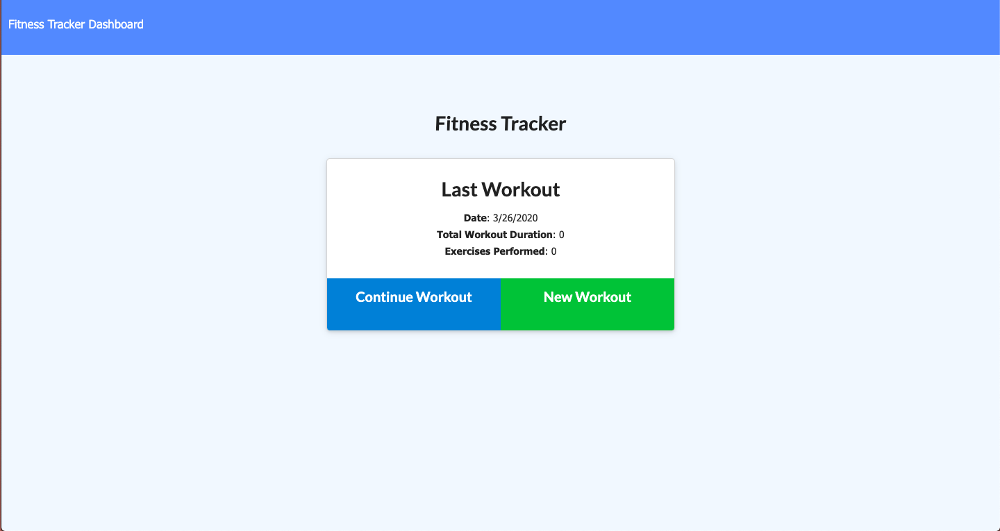

# Workout-tracker

This is a work out tracker app.
The user can track their workout by simply creating, and update their workout.

Deployed app : ()

 

## Table 0f Contents
- General Info
- Technologies
- Features

## Technologies

- MongoDB
- Mongoose
- Express

  Here are the npm package.json used :
- dependencies: 
    - "express": "^4.17.1",
    - "mongoose": "^5.9.5",
    - "morgan": "^1.10.0" 

## Features:
- User can create new workout / or update their previous workout
- User can also view their workout status on the stats page